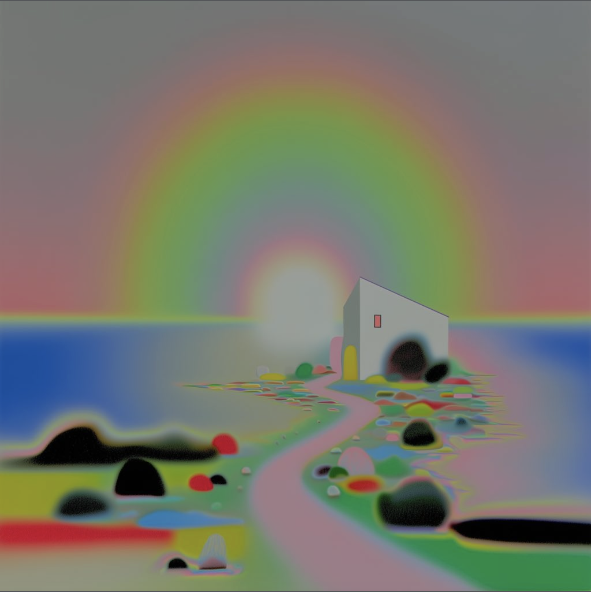

# Quiz 9 - The Search for Belonging in a Digitally Connected World

## Part1: Project Direction
### Project Path
Our team has chosen to reinterpret an existing artwork.
### Vision and the Inspiration
Our project, explores the persistent search for spiritual belonging amidst the rapid expansion of AI and digital connectivily. Inspired by the artist tuukzs's occultist aesthetics, we recontextualize their radiant rainbow auras as the "digital mirages" of our era ----- vibrant, AI-accelerated illusions of properity and happiness that are as fleeting as bubbles.
While the original artists foucuese on individul spirituality, our vision highlights the growing inner emptiness hidden behind hyper-connectivity. The solitary house symbolizes not a physical home, but the persistent core of the human-spirit - a sanctuary of authetic selfhood. We aim to vosualize the tension between being seduced by surface-level digital beauty and the necessity of diving deeper. Our project serves as a reminder: despite the overwhelming flux of ephemeral digital "perfection", we must not abandon the profound, often difficuly pursuit of true spiritual belonging within the network.
### References

[View the original artist page here](https://www.instagram.com/p/DRVKsYiCVXg/)

## Part2: Mechanics
### Audio: Yixin Liu
The audio mechanic uses P5.js's FFt (Fast Fourier Transform) analysis to read the volume and frequency comtent of a music track in real time, driving visual changes in the scene's rainbow and sky glow. When the music is loud or bass-heavy, the rainbow expands outward and its colours intensify, radiating warmth across the canvas. During quieter moments, the glow softens and contracts, giving the scene a sense of breathing in and out. Users interact by pressing the spacebar to play or pause the music track, and can press the up/down arrow keys to adjust the volume, directly controlling the energy of the visual response. This mechanic connects to the painting's theme of optimism — music becomes the emotional heartbeat of the world, making the sky respond to sound as if the landscape itself is alive. The rainbow, a universal symbol of hope, pulses and breathes with the rhythm of the music, reinforcing the sense of warmth and belonging that the original artwork evokes.
#### References
- [p5.FFT Reference](https://p5js.org/reference/p5.sound/p5.FFT/) — Official p5.js FFT documentation
- [p5.sound Library](https://p5js.org/reference/p5.sound/) — Official p5.sound library reference
- Original artwork: *The Search for Belonging in a Digitally Connected World* by Arthur Machado (Tu.uk'z)

### Time-based: Wanni Xiang
My time-based mechanic will show how belonging slowly builds over time. The pink path will gradually light up in small sections, guiding the viewer toward the house. The house window will softly pulse, making it feel warm and welcoming. I also want to add a slow rotating effect to the rainbow, so it feels like a moving digital connection field rather than a static background. This connects to our theme because finding belonging online is not immediate. It happens step by step through repeated interactions, until the space starts to feel more familiar and safe.
#### References
- [p5.js frameCount Reference](https://p5js.org/reference/p5/frameCount/) — Official p5.js documentation
- [p5.js sin() Reference](https://p5js.org/reference/p5/sin/) — Official p5.js documentation
- [p5.js rotate() Reference](https://p5js.org/reference/p5/rotate/) — Official p5.js documentation
- Original artwork: *The Search for Belonging in a Digitally Connected World* by Arthur Machado (Tu.uk'z)

### Perlin noise and randomness: Zihan Jiang
We employ Perlin Noise and Randomness to create the unstable, organic movement of the digital environment. Unlike the predictable rhythmic generated by the audio mechanic, this system continuously distorts the sky,sea, and ground through fluid drifting motion, subtle flickering, and occasional glitch events. Users indirectly interact with this mechanic through their presence and activity within the environment, casuing the instability and distortions to gradually intensify or soften over time. Random colour separations and static-like fragments briefly disrupt the landscape beofore dissolving again, symbolising the fragile and temporary nature of online uncertainty and instability hidden beneath digitally connected spaces, transforming the environment into a living world that constantly shifts between comfort and fragmentation.
#### References
- [Refik Anadol Studio](https://dataland.art/blog/qualia)
- [teamlab Interactive Environment](https://www.teamlab.art/e/living_digital_space/)
- [p5.js noise() Reference](https://p5js.org/reference/p5/noise/)
Used to create fluid and organic environment movement, simulating the unstable emotional atmosphere of digitally connected spaces.
- [p5.js random() Reference](https://p5js.org/reference/p5/random/)
Used to generate unpredictable glitch events and fragmented visual distortions, reinforcing themes of uncertainty and unstable digital belonging.
- [p5.js lerp() Reference](https://p5js.org/reference/p5/lerp/)
Used to create smooth visual transitions between shifting environmental states, helping the digital landscapes feel emotionally responsive and immersive.

### User input: Ruiqi Xu
When moving the mouse in the sky area, particle avoidance occurs. Clicking the mouse generates small stars with halos. When moving the mouse on the ground, ripples are generated. Left clicking triggers ripples. This dual interaction mode deepens the theme of "the pursuit of a sense of belonging in the digital interconnected world". The stars in the sky represent unattainable goals or dreams. Although users can create them, they cannot truly "touch" them (avoidance mechanism), symbolizing the sense of alienation in digital connections. The ripples on the ground represent the footprints and influences left by users on the digital wilderness, and this instant feedback gives users a sense of existence and belonging, closely connecting 'me' with this digital landscape.
#### References
- https://p5js.org/reference/p5/mouseIsPressed/ - p5.js mouseIsPressed
- https://natureofcode.com/autonomous-agents/ - Autonomous Agents
- Original artwork: *The Search for Belonging in a Digitally Connected World* by Arthur Machado (Tu.uk'z)
  

## Part3: Collaboration
#### Explaination

#### References

