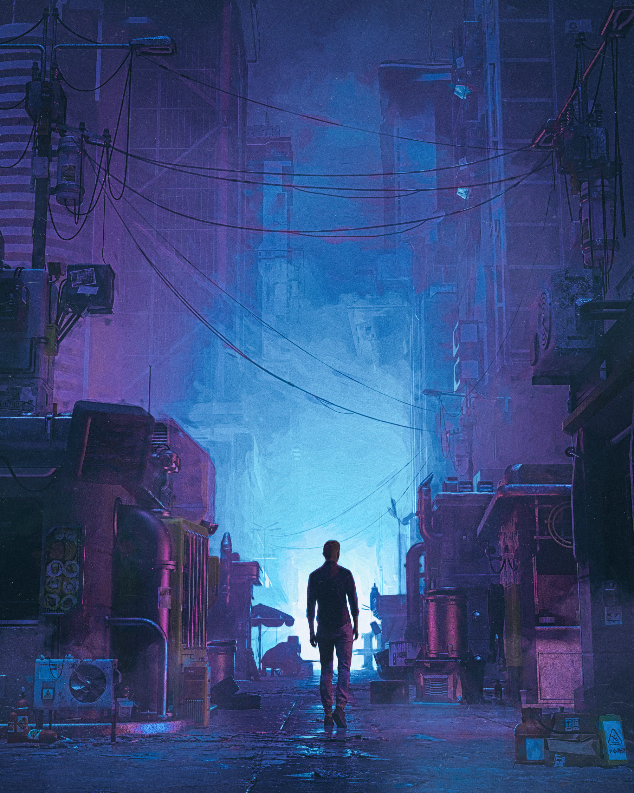

# Quiz 8 - Imaging and Coding Technique Exploration

## Part1: Imaging Technique Inspiration
### Cinematic Atmospheric Rendering in Beeple’s Digital Art
One of my greatest sources of inspiration is the globally acclaimed digital artist Beeple, whose artworks are renowned for using cinematic atmospheric rendering to create immersive futuristic environments. What draws me most is his masterful use of glow, layered lighting, haze, and colour gradients ---- elements that establish a powerful sense of mood and spatial depth. I find it compelling to translate these atmospheric techniques into my final project as a means of storytelling, transforming simple digital scenes into something far more immersive and emotionally expressive.
> Key Observation: Beeple uses atmospheric rendering to contruct immersive digital environments that evoke futuristic and cinematic moods.
### Inspiration Images

## Part2: Coding Technique Exploration
### p5.js blendMode() - Simulating Atmospheric Effects
`p5.js blendMode()` is a coding technique that controls how colours of overlapping elements are blended together. By applying modes such as `ADD` or `SCREEN`, it is possible to simulate atmospheric visual effects like glow, haze, and light diffusion - closely mirroring the cinematic rendering style seen in the Beeple's artworks. Combined with layered transparent shapes and colour gradients, this technique can transform a simple digital scene into one with greater depth and emotional atmosphere, making it a partical tool for achieving the immersive aesthetic I aim to explore in my final project.
### Example Image
### Example Code
[p5.js blendMode() Reference](https://p5js.org/reference/p5/blendMode/)
