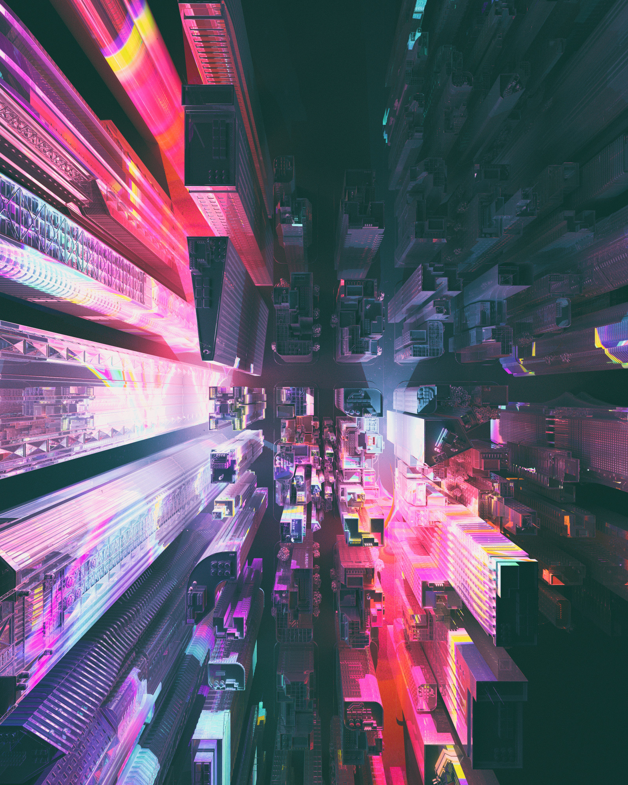

# Quiz 8 - Imaging and Coding Technique Exploration

## Part1: Imaging Technique Inspiration

### Cinematic Atmospheric Rendering in Beeple’s Digital Art
One of my greatest sources of inspiration is the globally acclaimed digital artist Beeple, whose artworks are renowned for using cinematic atmospheric rendering to create immersive futuristic environments. What draws me most is his masterful use of glow, layered lighting, haze, and colour gradients - elements that establish a powerful sense of mood and spatial depth. I find it compelling to translate these atmospheric techniques into my final project as a means of storytelling, transforming simple digital scenes into something far more immersive and emotionally expressive.
> **Key Observation:** Beeple uses atmospheric rendering to contruct immersive digital environments that evoke futuristic and cinematic moods.

### Inspiration Images

## Part2: Coding Technique Exploration

### p5.js blendMode() - Simulating Atmospheric Effects
`p5.js blendMode()` is a coding technique that controls how overlapping colours interact with each other. By enabling blendMode(), it is possible to simulate atmospheric visual effects, such as glow, layered lighting, haze, and colour gradients - similar to the cinematic rendering style seen in Beeple's artworks. Combined with transparent layers and colour gradients, this technique can transform simple digital scenes into more immersive environments with greater depth and emotional atmosphere, making it a valuable tool for achieving the visual storytelling aesthetic. In my final project, I envision applying it to background elements and light sources to enhance the overall sense of space and atmosphere.

### Example Image

### Example Code
[p5.js blendMode() Reference](https://p5js.org/reference/p5/blendMode/)
